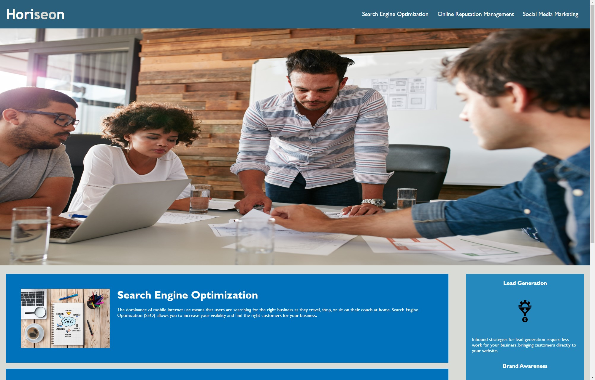

# Horiseon-Rework-Project

## Description

The goal for this project was to make an existing website more accessible. Using the provided starter code, I converted the existing HTML into semantic HTML. I also added an alt for the images. This project helped me understand why accessibility is important for any webpage.

## Github

https://github.com/elbringz

## Source

All starter code (HTML, CSS, Assets) came from https://github.com/coding-boot-camp/urban-octo-telegram
Portions of this code were edited by me as specified in the assignment instructions.

## Link to deployed application

https://elbringz.github.io/horiseon-rework/

## Screenshot

